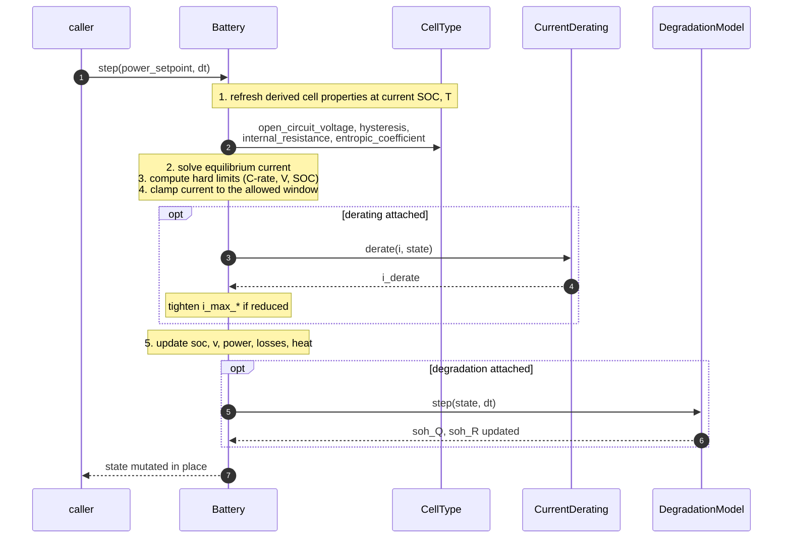

# Battery Model

How `Battery` simulates a pack of cells: what it owns, what it delegates to the cell model, and how one `step()` advances the state.

!!! info "Who this is for"
    Applied users building simulations, and extenders writing new cell models or derating strategies. If you just want to run a first simulation, start with [Getting Started](../getting-started.md).

## `Battery` and `CellType`

A simses battery is two things composed together: a **`Battery`** and a **`CellType`**.

[`CellType`][simses.battery.cell.CellType] is the **datasheet** of a single cell. It holds all the characteristics you would look up in a manufacturer spec — capacity, voltage window, C-rates, mass, specific heat, format — plus the electrochemical relations that define how the cell responds to its state: `open_circuit_voltage(state)`, `internal_resistance(state)`, and optionally `hysteresis_voltage()` and `entropic_coefficient()`. `CellType` is **stateless**: it never stores SOC, temperature, or any time-varying quantity; it just maps a state in, a scalar out. It also doesn't know about the timestep, the circuit, or the degradation model.

[`Battery`][simses.battery.battery.Battery] is the **simulator**. It owns the mutable [`BatteryState`][simses.battery.state.BatteryState], orchestrates one timestep at a time in [`step(power_setpoint, dt)`][simses.battery.battery.Battery.step], and exposes the interface that other subsystems (converter, thermal, degradation) compose with. A `Battery` composes a single `CellType` with a `circuit = (serial, parallel)` tuple and scales every cell-level quantity the cell model returns up to the pack level on demand — so the rest of the code simulates in pack units (V, A, Ω, Ah, W) and the cell model stays chemistry-focused.

```python
from simses.battery import Battery
from simses.model.cell.sony_lfp import SonyLFP

battery = Battery(
    cell=SonyLFP(),              # the "datasheet"
    circuit=(13, 2),             # 13 in series, 2 strings in parallel
    initial_states={"start_soc": 0.5, "start_T": 298.15},
)
```

Adding a new chemistry means writing a new `CellType`, not touching `Battery`. See [Choosing a Cell Model](../guides/cell-models.md).

## From cell to pack

Because `Battery` simulates at the pack level, every quantity the cell model returns is scaled by the `(serial, parallel)` circuit before it enters the ECM or the limits. Voltages and the entropic coefficient multiply by `serial`; capacity and max currents multiply by `parallel`; internal resistance scales with both and with the resistance SoH.

| Quantity | Symbol | Cell → pack |
|---|---|---|
| Open-circuit voltage | $\mathrm{OCV}$ | $\times\, s$ |
| Hysteresis voltage | $V_\mathrm{hys}$ | $\times\, s$ |
| Terminal voltage | $V$ | $\times\, s$ |
| Entropic coefficient | $\partial V / \partial T$ | $\times\, s$ |
| Internal resistance | $R_\mathrm{int}$ | $\times\, s/p \,\times\, \mathrm{SoH}_R$ |
| Capacity | $Q$ | $\times\, p \,\times\, \mathrm{SoH}_Q$ |
| Max charge / discharge current | $I_\max$ | $\times\, p$ |
| Nominal energy | $E$ | $\times\, s \,\times\, p$ |
| Thermal capacity | $C_\mathrm{th}$ | $\times\, s \,\times\, p$ |

Capacity fade ($\mathrm{SoH}_Q$) and resistance rise ($\mathrm{SoH}_R$) are tracked separately on `BatteryState` and enter the scaling at every step. See [Degradation](degradation.md) for how they evolve.

## Equivalent-circuit model

With cell characteristics scaled to the pack, the terminal voltage follows a Thevenin equivalent-circuit model:

$$
V = \mathrm{OCV}(\mathrm{SOC}, T) + V_\mathrm{hys} + R_\mathrm{int}(\mathrm{SOC}, T) \cdot I
$$

Given a power setpoint $P$, the battery must find the current $I$ that satisfies both $P = V \cdot I$ and the equation above. Substituting yields a quadratic in $I$:

$$
R_\mathrm{int} \cdot I^2 + (\mathrm{OCV} + V_\mathrm{hys}) \cdot I - P = 0
$$

The physically meaningful root — the one that collapses to $I \to 0$ as $P \to 0$ — is:

$$
I = \frac{-(\mathrm{OCV} + V_\mathrm{hys}) + \sqrt{(\mathrm{OCV} + V_\mathrm{hys})^2 + 4\, R_\mathrm{int}\, P}}{2\, R_\mathrm{int}}
$$

This is what [`Battery.equilibrium_current`][simses.battery.battery.Battery.equilibrium_current] returns. The special case $P = 0$ short-circuits to $I = 0$.

## The `step()` lifecycle

One call to `battery.step(power_setpoint, dt)` walks five phases. Derating and degradation are each gated on an optional component being attached at construction time.



### Hard limits

[`Battery.calculate_max_currents`][simses.battery.battery.Battery.calculate_max_currents] returns the allowed current window as the most restrictive of three bounds, per direction:

- **C-rate:** from `max_charge_rate` / `max_discharge_rate` on [`ElectricalCellProperties`][simses.battery.properties.ElectricalCellProperties].
- **Voltage window:** the current that would drive terminal voltage to `max_voltage` (charge) or `min_voltage` (discharge) this step, given the current OCV and Rint.
- **SOC window:** the current that would drive SOC to `soc_limits` this step, given the current capacity.

The solved equilibrium current is then clamped into `[i_max_discharge, i_max_charge]`. If the setpoint exceeds what these limits allow, `state.power` reflects the delivered power, not the original setpoint.

### Optional derating

A [`CurrentDerating`][simses.battery.derating.CurrentDerating] passed via the `derating=` argument runs *after* hard clamping and can only reduce $|i|$ further. Built-in strategies:

- [`LinearVoltageDerating`][simses.battery.derating.LinearVoltageDerating] — linearly ramps current to zero as terminal voltage approaches `max_voltage` (charging) or `min_voltage` (discharging).
- [`LinearThermalDerating`][simses.battery.derating.LinearThermalDerating] — linearly ramps current to zero between a start and a max temperature.
- [`DeratingChain`][simses.battery.derating.DeratingChain] — applies several strategies in sequence; short-circuits at zero.

When derating reduces the current, the reported `i_max_charge` / `i_max_discharge` are tightened to match. Outside the derating zone, the reported limits stay at the hard-limit values.

### Losses and heat

After the current is settled, `step()` writes irreversible and reversible dissipation:

$$
\begin{aligned}
\dot Q_\mathrm{irr} &= (V - \mathrm{OCV}) \cdot I \\
\dot Q_\mathrm{rev} &= \frac{\partial V}{\partial T} \cdot T \cdot I \\
\dot Q_\mathrm{heat} &= \dot Q_\mathrm{irr} + \dot Q_\mathrm{rev}
\end{aligned}
$$

Positive $\dot Q_\mathrm{heat}$ means heat generated inside the cell; it can turn slightly negative when reversible cooling exceeds Joule heating. `state.loss` holds only the irreversible component; `state.heat` is the total internal generation that thermal models read through the [`ThermalComponent`](thermal.md) protocol.

## Sign convention

Positive = charging, negative = discharging. Applies to both `power_setpoint` and the resulting current. The hard-limit tuple follows the same convention: `i_max_charge` is non-negative, `i_max_discharge` is non-positive.

## State

[`BatteryState`][simses.battery.state.BatteryState] is a plain slotted dataclass — no methods, just a bag of fields mutated in place by `step()`. The fields you most often read:

| Field | Unit | Meaning |
|---|---|---|
| `soc` | p.u. | State of charge after this step (clamped to `soc_limits`). |
| `v` | V | Terminal voltage. |
| `i` | A | Current after hard limits and optional derating. |
| `power` | W | Delivered power ($V \cdot I$). May differ from `power_setpoint`. |
| `power_setpoint` | W | Requested power, stored for diagnostics. |
| `loss` | W | Irreversible loss. |
| `heat` | W | Total internal heat (irreversible + reversible). |
| `T` | K | Cell temperature. Written by the thermal model, read by the cell model. |
| `soh_Q`, `soh_R` | p.u. | Capacity and resistance SoH. Written by the degradation model. |
| `i_max_charge`, `i_max_discharge` | A | Allowed current window this step (after derating). |

Derived-at-step fields — `ocv`, `hys`, `rint`, `entropy` — are refreshed in phase 1 so other consumers (e.g. derating) see consistent values. See the [API reference][simses.battery.state.BatteryState] for the complete field list.

## Where to go next

- **Choosing a cell chemistry:** [Choosing a Cell Model](../guides/cell-models.md).
- **Writing your own cell model:** [Extending cell models](../guides/cell-models.md#extending) — the `CellType` ABC only requires `open_circuit_voltage()` and `internal_resistance()`.
- **Hands-on walkthrough:** [Demo tutorial, Part 1](../tutorials/demo.ipynb).
- **API reference:** [`Battery`][simses.battery.battery.Battery], [`BatteryState`][simses.battery.state.BatteryState], [`CellType`][simses.battery.cell.CellType], [`CurrentDerating`][simses.battery.derating.CurrentDerating].
