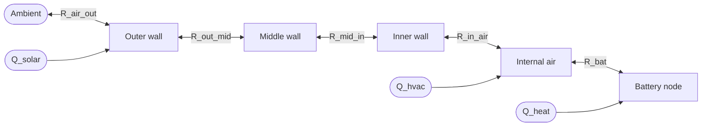

# Thermal Models

How simses couples battery heat generation to the surrounding environment — from a single constant-ambient coupling through to a containerised BESS with multi-layer walls, HVAC, and solar heat load.

!!! info "Who this is for"
    Applied users whose studies care about temperature (degradation rates, efficiency, thermal runaway margins, HVAC sizing), and extenders plugging in new HVAC hardware or control strategies. If you can assume an isothermal cell for your study, you can skip this subsystem entirely.

## Two environment models

The thermal subsystem ships two environment models that cover different levels of fidelity, wired into the rest of simses through one structural protocol.

[`AmbientThermalModel`][simses.thermal.ambient.AmbientThermalModel] is the **simple environment** — one node per registered component, each coupled by a lumped thermal resistance to a single ambient temperature. No walls, no air volume, no HVAC. Appropriate when the thermal environment can be treated as a uniform external temperature — bench tests, first-order sanity checks before adding container physics, or deployments where the pack sits in a climate-controlled room whose temperature you already have as a time series.

[`ContainerThermalModel`][simses.thermal.container.ContainerThermalModel] is the **physics-based environment** — a containerised BESS model with five coupled nodes (battery(ies), internal air, inner/mid/outer wall), an HVAC unit that injects or removes heat at the air node, and an optional solar heat load on the outer wall. Appropriate when wall conduction, air thermal mass, HVAC sizing, or diurnal external cycles matter.

Both expose the same public surface: construct, register heat-generating components via `add_component()`, call `step(dt)` in the simulation loop. What differs is the internal physics.

## What a thermal step does

A simulation run is really two step-loops interleaved. On each timestep the battery generates heat — Joule dissipation plus the reversible entropic term — and writes it to `state.heat`. The thermal model, on its own `step(dt)`, reads that heat from every registered component, advances each node's temperature by one Euler step, and writes the new temperature back onto the component's `state.T`. The next `battery.step()` reads the updated temperature when it evaluates OCV and Rint, and the loop continues.

Nothing in the thermal model calls `battery.step()`, and nothing in `battery.step()` calls the thermal model. The coupling is entirely through the shared mutable `state` — each side owns one half of the contract: battery writes `heat` and reads `T`; thermal model writes `T` and reads `heat`. This is what lets the same thermal model host a single battery, a multi-string pack, or a mix of batteries and other heat-generating components without any special cases.

```python
from simses.thermal import AmbientThermalModel

env = AmbientThermalModel(T_ambient=25.0)
env.add_component(battery)

for t in range(n_steps):
    battery.step(power[t], dt)
    env.step(dt)                    # reads battery.state.heat, writes battery.state.T
```

## The `ThermalComponent` contract

The thermal models talk to their nodes through [`ThermalComponent`][simses.thermal.protocol.ThermalComponent] — a structural Protocol exposing exactly four members:

| Member | Type | Direction | Meaning |
|---|---|---|---|
| `state.T` | float | read / written | Component temperature in °C. |
| `state.heat` | float | read | Total internal heat generation in W (sign: + = heats the component, − possible when reversible cooling dominates). |
| `thermal_capacity` | float | read | Lumped thermal capacity in J/K. |
| `thermal_resistance` | float | read | Thermal resistance to the surrounding air/ambient in K/W. |

A `Battery` satisfies this shape already, without inheritance — `state.T` and `state.heat` are fields on `BatteryState`, `thermal_capacity` and `thermal_resistance` are properties derived from the cell's `ThermalCellProperties` and effective cooling area. In principle any simses component with internal losses is a candidate thermal node: a `Converter` dissipates conversion losses that could be tracked as a node; a supercap or flow-battery storage could participate the same way. Today only `Battery` exposes all four members; adding them to another component is a small surface change that turns it into a first-class thermal node.

## `AmbientThermalModel`

`AmbientThermalModel` treats every registered component as an independent node coupled to a single ambient temperature. Per-component heat balance, forward-Euler integrated:

$$
C_{\mathrm{th},i} \frac{\mathrm{d}T_i}{\mathrm{d}t} \;=\; \dot Q_{\mathrm{heat},i} \;+\; \frac{T_\mathrm{amb} - T_i}{R_{\mathrm{th},i}}
$$

Left-hand side is the rate of change of the node's internal energy; the two right-hand terms are its own dissipation and the heat exchanged with the ambient through the lumped resistance. `T_ambient` is a public attribute — assigning to it at any step turns the model into a time-varying boundary condition driven by, e.g., a TMY weather profile.

No cross-coupling between components: two batteries in the same `AmbientThermalModel` influence each other only indirectly, through their shared ambient (i.e. not at all, at this level of fidelity). If node-to-node coupling matters, switch to `ContainerThermalModel`.

## `ContainerThermalModel`

`ContainerThermalModel` models the thermal environment of a real BESS container — batteries sit in an air volume, surrounded by three wall layers (typically inner aluminium / insulation / outer steel), which in turn exchange heat with the ambient. It has more moving parts than the ambient model and is worth a short preview before the details:

- A **five-node thermal network** — batteries, internal air, three wall layers — integrated forward-Euler each step against ambient and two drivers (HVAC, solar).
- **An HVAC subsystem** split into a *strategy* (decides how much heating/cooling the container needs) and *hardware* (converts thermal demand into an electrical cost). Both are Protocols, so you can swap either half independently.
- An optional **solar heat load** — a vectorised pipeline that pre-computes absorbed solar power on the container outer walls from a GHI time series. Feeds one driver on the thermal network.

Each of those gets its own section below.

### Thermal network

Five nodes (batteries, internal air, three wall layers) and six thermal couplings. HVAC injects/removes heat at the air node; solar adds heat to the outer wall.



Each node has a lumped thermal capacity; each edge is a thermal resistance. Capacities are precomputed once from [`ContainerProperties`][simses.thermal.container.ContainerProperties] (length × width × height × material ρ × cₚ for walls and air); resistances combine half-layer conductive plus surface convection terms. Each `step(dt)` evaluates the five forward-Euler node equations using current-step temperatures only (explicit scheme — stable for realistic wall thicknesses and timesteps of a few seconds).

Two ready-made presets are available as dataclass subclasses — [`FortyFtContainer`][simses.model.thermal.containers.FortyFtContainer] (12 m, rock-wool) and [`TwentyFtContainer`][simses.model.thermal.containers.TwentyFtContainer] (5.9 m, polyurethane). Instantiate them with no arguments for the defaults, or pass keyword arguments to override individual parameters:

```python
from simses.model.thermal.containers import FortyFtContainer

props = FortyFtContainer()                  # all defaults
props_less_air = FortyFtContainer(vol_air=0.7)   # 70 % of volume is air (rest is rack hardware)
```

The internal-air balance is the most useful node to reason about, since it's where HVAC lands and what the thermostat tracks:

$$
C_\mathrm{air} \frac{\mathrm{d}T_\mathrm{air}}{\mathrm{d}t} \;=\; \dot Q_\mathrm{HVAC} \;+\; \frac{T_\mathrm{in} - T_\mathrm{air}}{R_\mathrm{in\text{-}air}} \;+\; \sum_{i} \frac{T_{\mathrm{bat},i} - T_\mathrm{air}}{R_{\mathrm{bat},i}}
$$

Left-hand side is the rate of change of air enthalpy; the right-hand terms are the HVAC injection, conduction from the inner wall, and the sum of heat flows from every registered battery node. Each battery node itself follows the same heat balance as in the [ambient model above](#ambientthermalmodel), just coupled to `T_air` instead of `T_amb`. The three wall-layer nodes follow analogous conduction balances between their two neighbours (and, for the outer wall, an additional solar term `Q_solar` and the ambient-coupling resistance).

Two external drivers are updatable between steps:

- `container.T_ambient` — external temperature, e.g. driven by a weather series.
- `container.Q_solar` — absorbed solar power on the outer wall, typically obtained by pre-computing a full timeseries with [`solar_heat_load()`](#solar-heat-load).

Multiple components can be registered via `add_component()` — each becomes its own battery node, all coupled to the shared internal air. The HVAC strategy's reference temperature is the hottest registered component, so thermal management reacts to the worst-case node rather than an average.

### HVAC: strategy and hardware

When HVAC is active, `ContainerThermalModel.step(dt)` asks the *strategy* for a thermal power demand — positive to heat, negative to cool — then asks the *hardware* model how much electrical power that demand costs. The thermal value is injected into the air node; the electrical value is stored on `state.power_el` (always ≥ 0) for downstream accounting (parasitic load, system-level efficiency).

The split exists because the two concerns evolve independently. A thermostat, an MPC, or a rule-based scheduler all produce the same output — a thermal power demand — but don't care what hardware executes it. Conversely, swapping a constant-COP HVAC for a temperature-dependent chiller or a heat pump changes the electrical cost per watt of cooling but leaves the control policy untouched.

#### `ThermalManagementStrategy` (the brain)

[`ThermalManagementStrategy`][simses.thermal.container.ThermalManagementStrategy] is a Protocol: `control(T_ref, dt) -> Q_thermal`. Two implementations ship:

[`ThermostatStrategy`][simses.thermal.container.ThermostatStrategy] is a three-state hysteresis controller — `IDLE`, `HEATING`, `COOLING`. It watches `T_ref` (the hottest battery node) and compares it to a setpoint with a symmetric dead-band of ±`threshold`:

- From `IDLE`, it switches to `HEATING` once `T_ref` drops below `T_setpoint − threshold`, and to `COOLING` once `T_ref` rises above `T_setpoint + threshold`.
- From either `HEATING` or `COOLING`, it returns to `IDLE` as soon as `T_ref` reaches `T_setpoint`.

In `HEATING` mode it requests `+max_power` thermal; in `COOLING` it requests `−max_power`; in `IDLE` it requests zero. The asymmetry — entry requires crossing the full threshold, exit returns at the setpoint — is what prevents short-cycling around `T_setpoint`.

[`ExternalThermalManagement`][simses.thermal.container.ExternalThermalManagement] is a pass-through for studies that compute HVAC power outside the simulation (optimisation, MPC, co-simulation). It stores a single `Q_hvac` attribute that the external controller writes before each `container.step(dt)`, and `control()` returns exactly that. The container still calls the `HvacModel` to compute electrical draw, so the accounting stays consistent.

#### `HvacModel` (the hardware)

[`HvacModel`][simses.thermal.container.HvacModel] is a Protocol: `electrical_consumption(Q_thermal) -> float`. The default implementation [`ConstantCopHvac`][simses.thermal.container.ConstantCopHvac] applies a fixed coefficient of performance per direction:

$$
P_\mathrm{el} \;=\; \begin{cases}
\dot Q / \mathrm{COP}_\mathrm{heat} & \dot Q > 0 \\[2pt]
\lvert \dot Q \rvert / \mathrm{COP}_\mathrm{cool} & \dot Q < 0 \\[2pt]
0 & \dot Q = 0
\end{cases}
$$

Typical defaults are `COP_heating = 2.5`, `COP_cooling = 3.0`. A real chiller is non-linear in load and ambient temperature; more detailed models implementing the same Protocol can replace this drop-in.

### Solar heat load

[`solar_heat_load()`][simses.thermal.solar.solar_heat_load] pre-computes the absorbed solar power on the outer wall over a full timeseries in one vectorised pass, returning a `pd.Series` aligned with the input GHI index. The pipeline is:

1. **Astronomical solar position** from day-of-year, latitude, and longitude (Spencer 1971 Fourier series — no external library).
2. **Reindl decomposition** of global horizontal irradiance into direct and diffuse components via the clearness index.
3. **Per-face absorbed power** on the five exposed surfaces (N, S, E, W, roof) using geometric angle-of-incidence and the outer-surface absorptivity. Vertical faces also receive ground-reflected irradiance (albedo) and isotropic sky diffuse.

The input GHI must carry a **timezone-aware** `DatetimeIndex`; the function enforces this. Because the calculation depends only on site location and container geometry — not on simulation state — it runs once before the simulation loop:

```python
from simses.thermal.solar import SolarConfig, solar_heat_load

q_solar = solar_heat_load(
    ghi=ghi_series,                                    # pd.Series, W/m², tz-aware index
    container=container_properties,
    config=SolarConfig(latitude=48.14, longitude=11.58, azimuth=0.0),
)

for t, step in enumerate(timesteps):
    battery.step(power[t], dt)
    container.Q_solar = q_solar.iloc[t]                # feed per-step
    container.T_ambient = ambient_series.iloc[t]
    container.step(dt)
```

Roof is treated differently from vertical faces (full sky view, no ground-reflected component). Night-time and below-horizon rows evaluate to zero without special-casing.

## State

[`AmbientThermalModel.state`][simses.thermal.ambient.AmbientThermalState] is a single field (`T_ambient`). [`ContainerThermalModel.state`][simses.thermal.container.ContainerThermalState] carries the full node picture:

| Field | Unit | Meaning |
|---|---|---|
| `T_air` | °C | Internal air temperature. |
| `T_in`, `T_mid`, `T_out` | °C | Wall-layer temperatures. |
| `T_amb` | °C | External ambient (updatable driver). |
| `Q_solar` | W | Absorbed solar power on the outer wall (updatable driver). |
| `power_th` | W | HVAC thermal power delivered this step (+ heat, − cool). |
| `power_el` | W | HVAC electrical draw this step (≥ 0). |

Battery temperatures live on each battery's own `state.T`, not here — registered components own their temperatures; the container only owns its environment.

## Where to go next

- **Multi-string packs with a shared thermal environment:** [Multi-String Systems](../guides/multi-string.md).
- **API reference:** [`AmbientThermalModel`][simses.thermal.ambient.AmbientThermalModel], [`ContainerThermalModel`][simses.thermal.container.ContainerThermalModel], [`ThermalComponent`][simses.thermal.protocol.ThermalComponent], [`HvacModel`][simses.thermal.container.HvacModel], [`ThermalManagementStrategy`][simses.thermal.container.ThermalManagementStrategy], [`solar_heat_load`][simses.thermal.solar.solar_heat_load].
